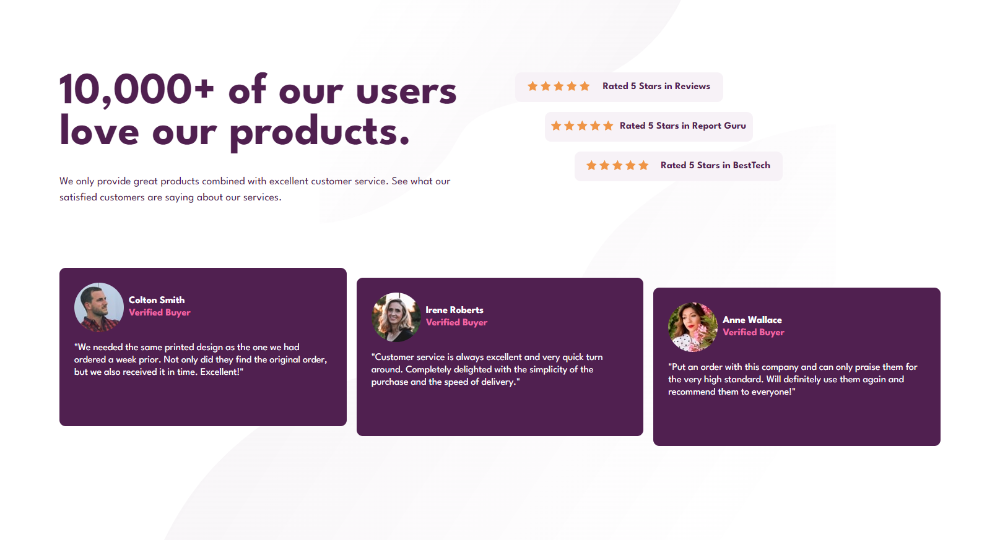
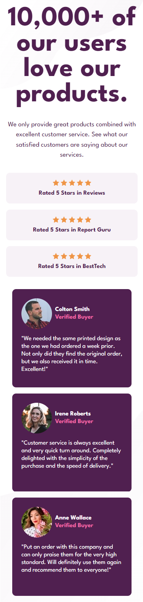

# Social Proof Section

## Overview

This project showcases a "Social Proof Section" designed to highlight positive customer feedback and ratings. Built with HTML and CSS, it features the 'League Spartan' font from Google Fonts for bold and readable text. This section is an excellent addition to any website looking to build trust through user testimonials and ratings. It not only demonstrates high satisfaction rates with star ratings but also includes detailed customer testimonials for a more personal touch.

## Features

- **Responsive Layout:** Ensures the section looks great on devices of all sizes.
- **Custom Typography:** Uses League Spartan for a strong presentation of text.
- **Customer Ratings:** Displays star ratings from various review platforms, indicating high customer satisfaction.
- **Testimonials:** Includes real customer testimonials, providing potential customers with relatable feedback.

## Screenshots





## Setup

To use this component in your project, follow these steps:

1. **Clone the Repository:**

```bash
git clone https://github.com/Wilmer856/social-proof-section.git
```

2. **Navigate to the Project Directory:**

```bash
cd social-proof-section-master
```

3. **Open the `index.html` file in a web browser to view the component.**

## Customization

- **Images and Icons:** Replace the star icons and customer photos in the images directory with your assets to personalize the section.
- **Images:** Edit the text to reflect your own customer reviews and company ratings.
- **Styling:** Adjust the 'style.css' to align with your brand's color scheme and typography preferences.

## Dependencies

- Google Fonts: [League Spartan](https://fonts.google.com/specimen/League+Spartan) for typography.
